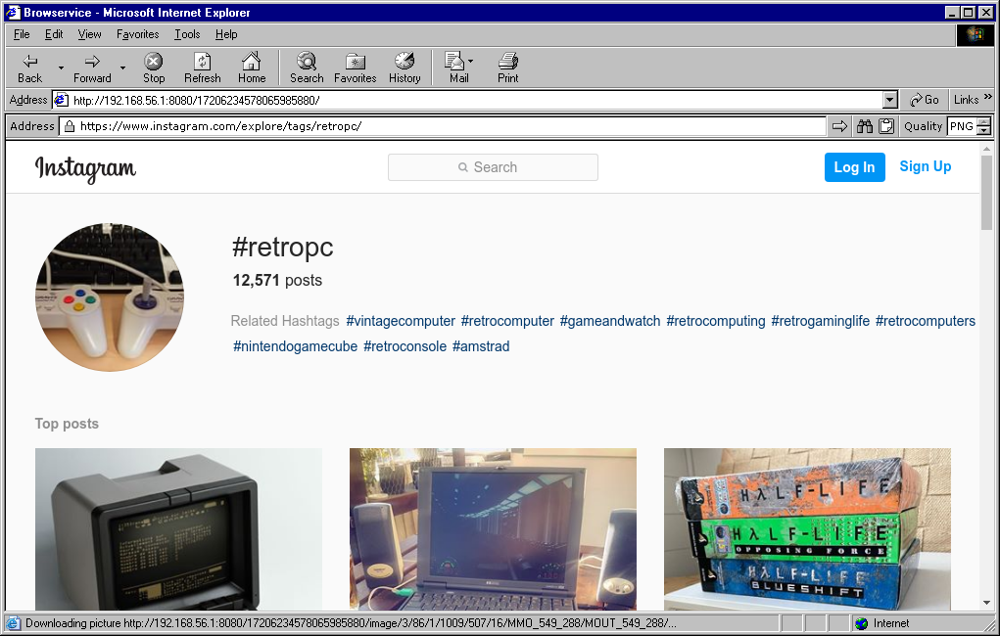
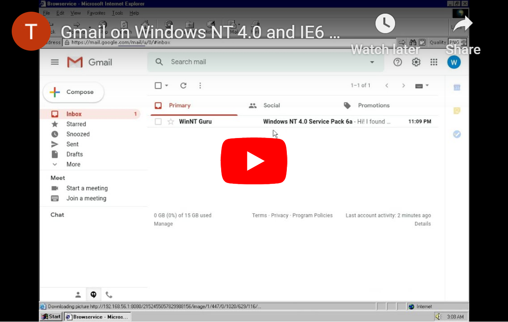
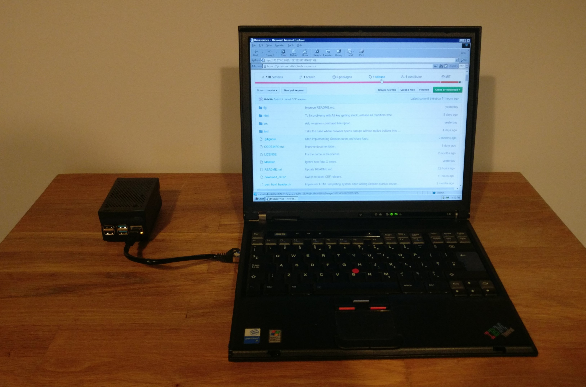
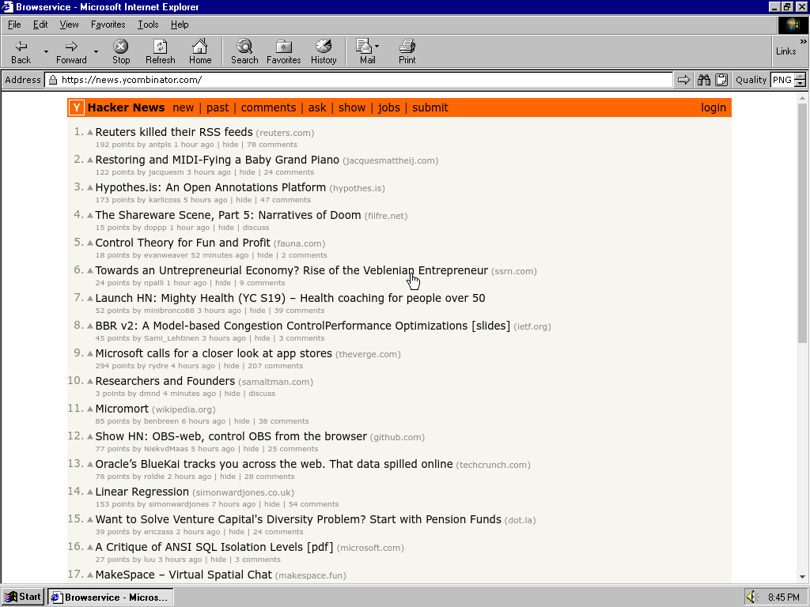
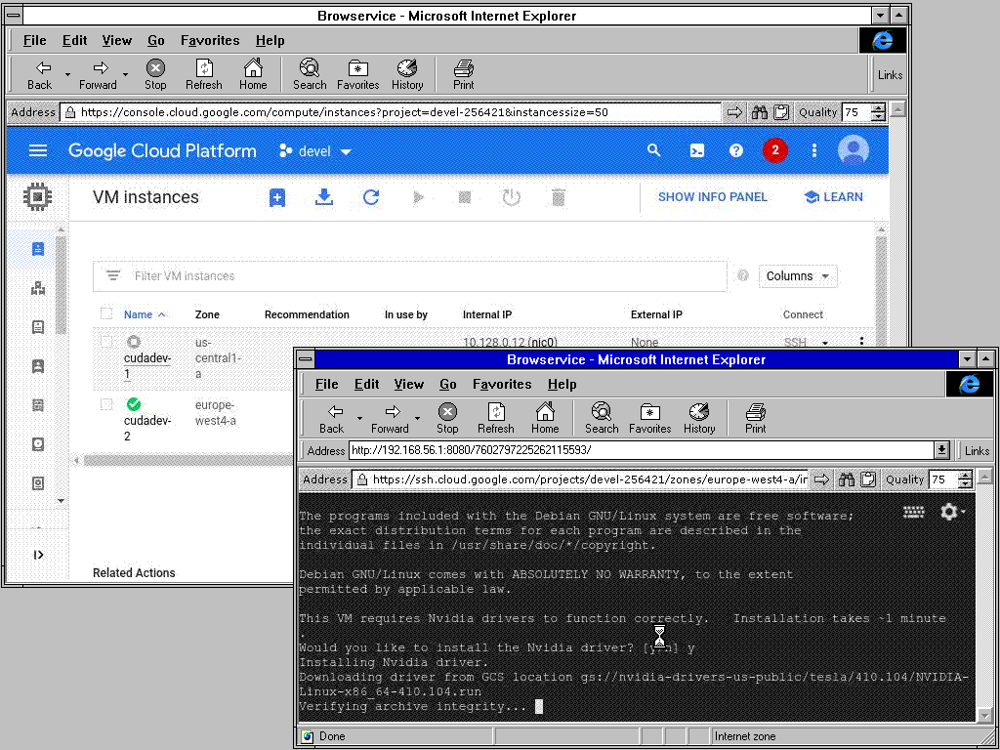
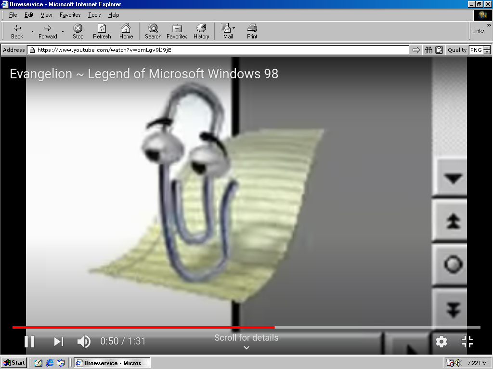
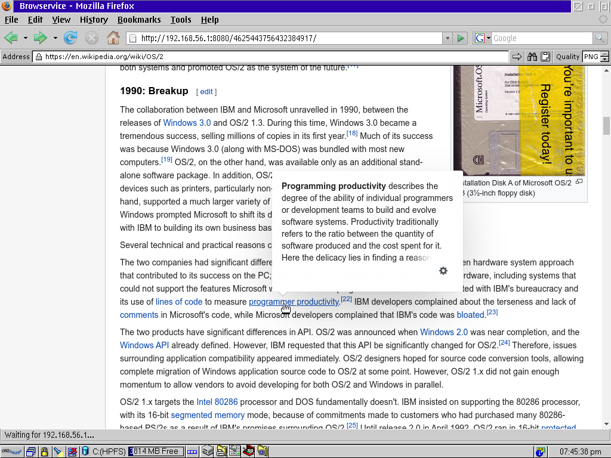
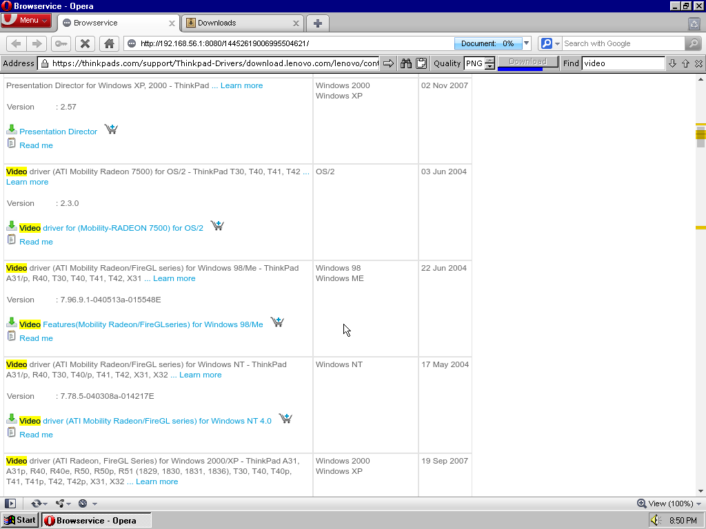
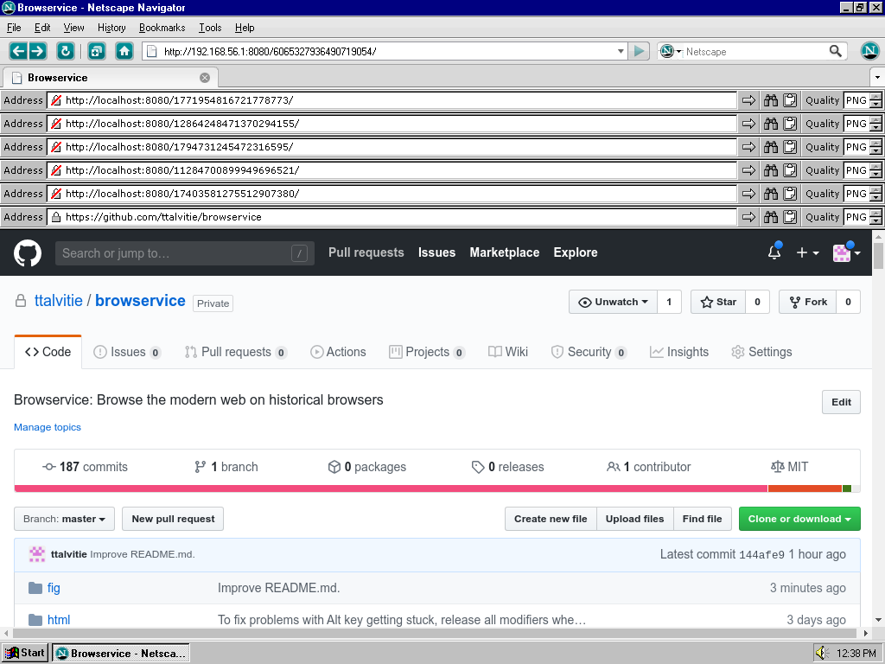

# Browservice: Browser as a Service

A web "proxy" server that enables browsing the modern web on historical browsers. It works by rendering the browser viewport into images, which are then shown by a JavaScript application running on the client browser.

## News

2022-11-23: [Browservice 0.9.6.1](https://github.com/ttalvitie/browservice/releases/tag/v0.9.6.1) has been released.

2022-11-05: [Browservice 0.9.6.0](https://github.com/ttalvitie/browservice/releases/tag/v0.9.6.0) has been released.

2022-03-26: [Browservice 0.9.5.0](https://github.com/ttalvitie/browservice/releases/tag/v0.9.5.0) has been released. This release adds support for soft navigation buttons in the browser area and partial blocking of local file access.

2021-12-19: [Browservice 0.9.4.0](https://github.com/ttalvitie/browservice/releases/tag/v0.9.4.0) has been released. This release adds support for running the proxy server on Windows (both 32-bit and 64-bit) and drops support for the i386 architecture on Linux (as Chromium no longer supports it).

2021-09-24: [Browservice 0.9.3.0](https://github.com/ttalvitie/browservice/releases/tag/v0.9.3.0) has been released. This release adds support for bookmarks and changing URL from the client browser by appending `goto/URL` to the address.

2021-05-28: [Browservice 0.9.2.2](https://github.com/ttalvitie/browservice/releases/tag/v0.9.2.2) has been released. This is the first release with self-contained prebuilt binaries available. The installation should be very simple; just download the correct AppImage, add execute permissions and run it ([see instructions](#running-the-browservice-proxy)).

2021-02-13: [Browservice 0.9.2.0](https://github.com/ttalvitie/browservice/releases/tag/v0.9.2.0) has been released. This release adds support for file uploads. It also features a major internal reorganization in which the code has been split into two parts that communicate through a [plugin C API](#vice-plugin-api); this should make it easier to add support for native clients in the future.



[](https://www.youtube.com/watch?v=oI6wJbMKjoQ)

[See more screenshots](#screenshots)

## How does it work?

The Browservice server uses [CEF (Chromium Embedded Framework)](https://bitbucket.org/chromiumembedded/cef) to run a Chromium browser instance that renders the browser view into an off-screen buffer. The browser view, combined with a control UI bar, is then compressed as a PNG or JPEG image and served to the client using an embedded HTTP server. The client browser runs a JavaScript application that requests and shows the images. It also listens for keyboard and mouse events from the user and forwards them to the proxy by including them in the URLs of the image requests.

Initially, this approach of sending the whole browser view as a new image every time it changes might sound quite inefficient. However, it is surprisingly usable if the network connection between the proxy server and the client is fast (such as 100 Mbit/s Ethernet LAN). Early 00s hardware (~1 GHz CPU clock) can often surpass 10 FPS in video streaming. The performance is also tolerable on older machines if a low JPEG compression level is used and the browser window is small.

The current features of Browservice include the following:

- Viewing of and keyboard/mouse interaction with all the web pages supported by the Chromium browser; this includes web apps such as YouTube, ~Gmail~, GitHub, Office on the web, Twitter, Facebook and Instagram (logging in Gmail and other Google services may be difficult due to new embedded browser login restrictions)
- Support for multiple concurrent browser windows
- Text clipboard common to all browser windows (accessed through Ctrl+C and Ctrl+V)
- Form for accessing the browser clipboard from the client side
- Control bar with an artisanal UI drawn in a style that blends well into a Windows 9x/NT4/IE6 environment
- Address field implemented entirely on the proxy server
- File downloads (with confirmation button on the control bar for security)
- File uploads
- Text search within the current page
- Bookmarks
- Image compression quality selectable on the fly (JPEG compression levels or PNG)
- Native Back/Forward/Refresh buttons on the client forwarded to the browser
- Custom multithreaded implementation of PNG compression (standalone library; you just need `png.hpp` and `png.cpp` from directory `viceplugins/retrojsvice/src`)

The following features are currently missing but could be implemented in future versions:

- Streaming audio to client (currently audio is played locally by the proxy server)
- Less hackish keyboard handling (different browsers send very different JavaScript key events)
- Integration with web search engines
- Page zooming

## Background

In retrocomputing, the modern web is inaccessible, because up-to-date web browsers are not available for old operating systems, and old browsers do not support modern web standards. Furthermore, old operating systems and browsers should not be connected directly to the Internet because they typically have unpatched security vulnerabilities. Browservice circumvents these issues by offloading the web rendering to a proxy server running an up-to-date web browser; the actual client browser connecting to the proxy only needs to show the images sent by the proxy server and forward the user input back to the proxy.

This idea of using a proxy to render the browser view into images has been used before by [WRP (Web Rendering proxy)](https://github.com/tenox7/wrp). Browservice differs from WRP in that it uses JavaScript on the client browser to animate the browser view and gather user input events, while in WRP, the user has to use web forms and image maps to provide the input, and the page has to be reloaded for every update in the view. Thus Browservice gives the user a more immersive web browsing experience, but also requires a newer client browser and more powerful hardware. While WRP can run on browsers as old as NCSA Mosaic 2.0, the [earliest supported client browsers](#supported-client-browsers) for Browservice are from late 90s and early 00s.

### Security

It is always a security risk to work with untrusted data (such as web page content) with outdated software. If we assume that the proxy server is kept up to date, and the connection between the proxy server and the client is made through a trusted isolated network, Browservice significantly reduces the attack surface, because the untrusted data reaches the client only as images that were compressed by Browservice or file downloads or clipboard data that were explicitly requested by the user. Not even the URLs of the accessed pages are sent to the client browser as text because the address bar is rendered on the server side (Browservice is not a real HTTP proxy). Despite the reduced attack surface, security is not guaranteed, and you should make sure to really know what you are doing before using Browservice for security-critical web browsing.

## Supported client browsers

The following historical OS-browser-combinations have been confirmed to work as clients for the proxy (some with minor limitations; see the descriptions for the numbers below the table). In addition, modern browsers can typically be used as clients.

| Operating system             | Browser                    | Limitations    |
| ---------------------------- | -------------------------- | -------------- |
| Windows for Workgroups 3.11  | Internet Explorer 4.0      | 1, 2, 3, 4, 9  |
| Windows for Workgroups 3.11  | Internet Explorer 5        | 1, 3, 4, 9     |
| OS/2 Warp 4.52               | Firefox 2.0.0.14           |                |
| Windows 95                   | Internet Explorer 4.01 SP2 | 2, 3, 4        |
| Windows 95                   | Internet Explorer 5.5 SP2  |                |
| Windows 95                   | Firefox 1.5.0.12           |                |
| Windows 95                   | Opera 10.63                | 2, 5           |
| Windows 98 Second Edition    | Internet Explorer 5        | 8              |
| Windows 98 Second Edition    | Internet Explorer 6 SP1    |                |
| Windows 98 Second Edition    | Firefox 2.0.0.20           |                |
| Windows 98 Second Edition    | Netscape 7.2               | 6              |
| Windows 98 Second Edition    | Netscape 9.0.0.6           |                |
| Windows NT 4.0 SP6a          | Internet Explorer 4.0      | 2, 3, 4, 7     |
| Windows NT 4.0 SP6a          | Internet Explorer 5        | 8              |
| Windows NT 4.0 SP6a          | Internet Explorer 5.5 SP2  |                |
| Windows NT 4.0 SP6a          | Internet Explorer 6 SP1    |                |
| Windows NT 4.0 SP6a          | Firefox 1.0.1              | 6              |
| Windows NT 4.0 SP6a          | Firefox 2.0.0.20           |                |
| Windows NT 4.0 SP6a          | Netscape 9.0.0.6           |                |
| Windows XP SP3               | Internet Explorer 6 SP3    |                |
| Windows XP SP3               | Internet Explorer 8        |                |
| Windows XP SP3               | Firefox 1.0.1              | 6              |
| Windows XP SP3               | Firefox 52.3.0 ESR         |                |
| Windows XP SP3               | Chrome 1.0.154             |                |
| Windows XP SP3               | Chrome 49.0.2623           |                |
| Debian GNU/Linux 3.1 "Sarge" | Firefox 1.0.4              |                |

1. PNG is not supported.
2. The mouse cursor flickers between the true cursor and an hourglass.
3. Right click works, but it also opens a context menu in the client browser.
4. The browser has the following bug that affects Browservice: In some cases where the browser window loses focus (such as when pressing the Ctrl+F key), the keyboard handler may move into an invalid state where some keys are unavailable or the Ctrl key is stuck down. To rectify this, the user has to manually press and release Ctrl.
5. The client browser back/forward buttons do not work (you can still use Backspace and Shift+Backspace).
6. Typing special characters using the AltGr key does not work in the browser area (you can still paste them from the clipboard).
7. The names of downloaded files are garbled.
8. The names of uploaded files are garbled.
9. Performance is typically poor.

The client support has been tested using the procedure documented in the `test` directory. It would be interesting to hear about your experiences on different platforms. Browservice is expected to work on Internet Explorer or Firefox on old m68k and PowerPC Macs, but due to lack of access, these have not been tested.

## Setup

A Browservice setup consists of two machines; the Browservice proxy server and the client. Currently, supported operating systems for the proxy server are Linux (x86_64, ARM and ARM64) and Windows (x86 and x86_64). The proxy server should also have sufficient memory and CPU performance to run the Chromium browser. Due to the Linux kernel features required by the Chromium security sandbox, it is difficult to get the Browservice proxy to run in a Docker container; users of operating systems other than Linux or Windows should typically run the Browservice proxy server in a Linux virtual machine.

For the client, many different operating systems and browsers should work, but the greatest chance of success is achieved using an OS-browser-combination that is close to one of the entries in the [table of supported client browsers](#supported-client-browsers). The performance of the different client browsers have not been benchmarked, but as a rule of thumb for Windows systems, the newest version of Internet Explorer available for the system is typically the fastest.

Only the proxy server needs an Internet connection; the client only needs to be able to connect to the proxy server. It is advisable not to expose the client directly to the Internet. One possible network setup is to have two interfaces on the proxy server: one for Internet and another for the local connection to the client. If both machines are virtual machines, host-only adapters can be used for the local connection between the proxy server and the client. The proxy server should be configured to only accept connections from the isolated local network between the proxy and client machines to prevent unauthorized users from gaining access to the browser.

Here is one example of a mobile hardware Browservice setup that has shown to be working well: The proxy server is running on a Raspberry Pi 4 (fitted with a fan and a battery) that connects to the Internet using Wi-Fi. The client is an IBM ThinkPad T40 running Windows NT 4.0 and Internet Explorer 6. The client connects to the proxy server through a direct patch cable between the Ethernet ports of the machines; the Ethernet interfaces are configured with static IPs in the same private subnet.



### Running the Browservice proxy

This section provides instructions for running the Browservice proxy server using prebuilt binary bundles on [Linux](#linux) and [Windows](#windows). If you want to build Browservice from source instead of using prebuilt binaries, you can follow the instructions in [BUILD.md](BUILD.md).

#### Linux

The AppImage is the easiest way to get the Browservice proxy server running on Linux starting from version 0.9.2.2, and it should work directly on any up-to-date Linux distribution for the x86_64, ARM or ARM64 CPU architecture. 

On the proxy server, download the AppImage file `browservice-RELEASE-ARCH.AppImage` for the [latest release](https://github.com/ttalvitie/browservice/releases). `ARCH` should match the architecture of your Linux installation (for most modern PCs it is `x86_64`; for Raspberry Pi OS it is `armhf`, and for 64-bit Linux installations on Raspberry Pi it is `aarch64`).

Navigate to the directory containing the downloaded AppImage file and make it executable by running the following command (replacing `RELEASE` and `ARCH` by the actual release and architecture in the downloaded file):

```
chmod +x browservice-RELEASE-ARCH.AppImage
```

Now you can start the Browservice proxy by running the following command as a normal user (do NOT use root):

```
./browservice-RELEASE-ARCH.AppImage
```

The graphical user interface of Browservice is designed for use with the Verdana font. Due to licensing restrictions, the AppImage does not directly bundle it; instead, it uses a free font that works just as well but does not look as good. To install Verdana to `$HOME/.browservice/appimage/fonts` where Browservice will find it, run the following command and type `yes` to accept the license agreement:

```
./browservice-RELEASE-ARCH.AppImage --install-verdana
```

For more information on running and configuring the proxy server, continue to the [proxy server configuration](#proxy-server-configuration) section.

#### Windows

For Windows, the prebuilt binaries are distributed in a zip file `browservice-RELEASE-windowsBITS.zip` (BITS is either 32 or 64; the 64-bit version should be used on most modern Windows PCs). To run Browservice, download the correct zip file for the [latest release](https://github.com/ttalvitie/browservice/releases), extract it, open a Command Prompt, navigate to the extracted directory and run the following command:

```
browservice.exe
```

If you do not want to use the Command Prompt, you may also click `browservice.exe` directly from File Explorer (a console window containing the log opens automatically); to pass command line options, you can use a shortcut or a batch file.

For more information on running and configuring the proxy server, continue to the next section.

#### Proxy server configuration

With the default arguments, the Browservice proxy starts listening for HTTP connections on port 8080. If the server fails to start, see the [troubleshooting](#troubleshooting) section for possible fixes. To stop the server, you can use the `SIGTERM` or `SIGINT` signals (you can send the latter using Ctrl+C).

By default, the listening socket is bound to `127.0.0.1`, which means that the server only accepts local connections. To allow other computers to connect to the server, you need to adjust the `--vice-opt-http-listen-addr` command line option; for example, to accept connections on all interfaces, bind to `0.0.0.0` as follows:

```
# See WARNINGs below!

# Linux:
./browservice-RELEASE-ARCH.AppImage --vice-opt-http-listen-addr=0.0.0.0:8080

# Windows:
browservice.exe --vice-opt-http-listen-addr=0.0.0.0:8080
```

**WARNING**: Binding to `0.0.0.0` may allow unauthorized users to connect to the server. Giving untrusted users access to the server is very dangerous; for example, they can access all the user accounts on websites to which you have logged in using Browservice. To avoid this, restrict the incoming connections to isolated local networks using a restrictive listen address and/or a firewall.

**WARNING**: Browservice does not support encrypted connections between the Browservice proxy and the client browser. Therefore, these connections should always be made over a completely trusted/isolated network (or over a secure tunnel).

**WARNING**: The trust between the client and the proxy server has to be mutual, as the client controls a web browser process running on the proxy server. Even though the `file://` protocol for reading files on the proxy server has been blocked by default, there are probably other ways to for the client to access files and other resources that are available to the user running `browservice`.

**WARNING**: The AppImage or the prebuilt binary directory on Windows (including the embedded Chromium browser) does not update itself. The security updates of your Linux distribution do not update the libraries bundled in the AppImage. To keep the browser up to date, you should periodically install the newest release of Browservice.

The clipboard and browser storage (cookies, local storage, cache, etc.) are shared among all the clients of the same Browservice instance, and thus you should start a separate instance for each user. By default, the browser runs in incognito mode, which means that all the browser storage is lost when the Browservice server is stopped. To avoid losing your session cookies and cache, you can persist the storage by specifying an absolute path to the storage directory in the `--data-dir` option (for example `--data-dir=$HOME/.browservice/cefdata` on Linux)

There are many other useful command line options in Browservice. To get a list of them, run:

```
# Linux
./browservice-RELEASE-ARCH.AppImage --help

# Windows
browservice.exe --help
```

## Browser usage

To open a new browser window, you should navigate the client browser to the address where the Browservice proxy server is listening (for example, `http://192.168.56.1:8080/`). To make it easier to open new browser windows, this should be set as the home page for the client browser.

After this, you can browse the web as you typically would, as long as you remember to use the in-page Browservice "Address" text field instead of the native browser address field. In some client browsers, you can disable the native browser controls to free up screen space and avoid confusion.

Some notes that might be useful:

- If the page offers a file for download, you need to explicitly accept it by clicking the Download button that appears in the control bar (after making sure that you trust the page). Browservice then downloads the file into a temporary directory on the proxy server, after which it forwards the file to the client browser.

- If the page requests a file upload, a separate upload popup window is automatically opened. After uploading the file in the upload window, the file will be placed in a temporary directory and forwarded to the page requesting the upload. Due to technical limitations, all the uploaded files will be stored in the temporary directory until the browser window is closed.

- If the page opens a popup window, Browservice automatically opens a new client browser window for it. However, creating this window might be blocked by the popup blocker of the client browser, and you may need to explicitly allow it or change the blocker settings.

- You can use Ctrl+C and Ctrl+V to copy and paste text between different Browservice windows (including the control bar). However, this clipboard is not automatically shared with the client system. To access the clipboard from the client, click the clipboard icon in the control bar to open a window that contains a text field and buttons for loading the clipboard into the text field and saving the contents of the text field into the clipboard. Note that it is a security risk to load text copied from an untrusted page into the native text field.

- The most common browser hotkeys (Backspace, Shift+Backspace, Ctrl+F, Ctrl+L, Ctrl+A, Ctrl+R, F5, PgUp/PgDown, Home/End) work with Browservice. However, some client browsers capture these keys instead of sending them to Browservice. For some Ctrl-based shortcuts, you can get around this by adding Shift into the combination, for example using Ctrl+Shift+F instead of Ctrl+F.

- You can navigate directly to given URL using the client browser address bar in two ways: 
     - To open a new Browservice window to given URL, navigate the client browser to `http://BROWSERVICE/goto/URL`. For example, `http://192.168.56.1:8080/goto/google.com` opens a new Browservice window with `google.com` as start page.
     - To navigate an existing Browservice window to given URL, append `goto/URL` to the address. For example, if the URL of the window shown by the client browser is `http://192.168.56.1:8080/1/qu7cHJCHqtYeHjasBedM3b42tlS4nEOM/`, then by changing it to `http://192.168.56.1:8080/1/qu7cHJCHqtYeHjasBedM3b42tlS4nEOM/goto/https://github.com/ttalvitie/browservice` you can navigate that Browservice window to `https://github.com/ttalvitie/browservice`.

- If you have many browser windows open at the same time, your may experience lag due to the per-server keep-alive connection limit of the client browser, as Browservice uses long polling HTTP requests. If you use Internet Explorer version up to 6 on Windows, the limit can be set by creating/setting the `MaxConnectionsPerServer` DWORD value in registry key `HKEY_CURRENT_USER\SOFTWARE\Microsoft\Windows\CurrentVersion\Internet Settings`. As a rule of thumb, the value should be at least the number of browser windows multiplied by two.

- By default, Browservice can't play videos that use proprietary audio/video codecs such as H264 and AAC, as the prebuilt CEF distribution [provided by Spotify](https://cef-builds.spotifycdn.com/index.html) does not include them. To add the codecs, build the CEF distribution by following the [instructions](https://bitbucket.org/chromiumembedded/cef/wiki/AutomatedBuildSetup.md) with the options `proprietary_codecs=true ffmpeg_branding=Chrome` appended to the environment variable `GN_DEFINES` (on Windows, you need to build the patched CEF version as shown in the [Windows build instructions](winbuild/README.md)). After this, you should proceed with the Browservice build process, using your self-built CEF instead of the prebuilt CEF distribution (in a [Linux build](BUILD.md), prior to running `setup_cef.sh`, copy the CEF distribution produced by the build to `cef.tar.bz2` instead of using `download_cef.sh` to download it). Note that building CEF takes a lot of time, memory and disk space. Also note that you may have to pay license fees to use the proprietary codecs legally, as they are encumbered by patents.

## Troubleshooting

### FUSE missing

```
fuse: failed to exec fusermount: No such file or directory

Cannot mount AppImage, please check your FUSE setup.
You might still be able to extract the contents of this AppImage
if you run it with the --appimage-extract option.
See https://github.com/AppImage/AppImageKit/wiki/FUSE
for more information
open dir error: No such file or directory
```

This error occurs when starting the AppImage if FUSE (Filesystem in Userspace) is not installed. To fix this, install FUSE using the package manager of your Linux distribution.

An alternative fix that does not require root privileges is to extract the contents of the AppImage into a directory, and run Browservice from there:

```
# Extract the AppImage into directory 'squashfs-root'
./browservice-RELEASE-ARCH.AppImage --appimage-extract

# Give the directory a better name
mv squashfs-root browservice-RELEASE-ARCH.AppDir

# Start Browservice
browservice-RELEASE-ARCH.AppDir/AppRun
```

### SUID sandbox helper not found

```
[0523/185347.885758:FATAL:setuid_sandbox_host.cc(158)] The SUID sandbox helper binary was found, but is not configured correctly. Rather than run without sandboxing I'm aborting now. You need to make sure that /tmp/.mount_browsezuuVgT/opt/browservice/chrome-sandbox is owned by root and has mode 4755.
```

On kernels with user namespaces disabled (or old kernels without user namespace support), Chromium uses a sandbox helper executable that needs the SUID bit to function correctly. The AppImage cannot add this SUID bit automatically, as it requires root privileges.

One possible fix is to enable user namespaces. On Debian-based distributions, this can be done by running the following command as root:

```
sysctl -w kernel.unprivileged_userns_clone=1
```

Another option is to extract the contents of the AppImage into a directory, add the SUID bit to the extracted helper executable and use the extracted Browservice executable:

```
# Extract the AppImage into directory 'squashfs-root'
./browservice-RELEASE-ARCH.AppImage --appimage-extract

# Give the directory a better name
mv squashfs-root browservice-RELEASE-ARCH.AppDir

# Set proper permissions for chrome-sandbox as root
sudo chown root:root browservice-RELEASE-ARCH.AppDir/opt/browservice/chrome-sandbox
sudo chmod 4755 browservice-RELEASE-ARCH.AppDir/opt/browservice/chrome-sandbox

# Start Browservice
browservice-RELEASE-ARCH.AppDir/AppRun
```

## Vice plugin API

Starting from release 0.9.2.0, Browservice consists of two parts: the main Browservice program, which manages the web browser using CEF, and the Retrojsvice plugin, which serves the browser GUI to the clients (historical browsers) over HTTP. These two parts communicate using the vice plugin C API, which is documented in the header file [vice_plugin_api.h](vice_plugin_api.h). Both of these parts can be reused independently. By replacing the vice plugin, the way the Browservice web browser is accessed can be changed; for example, servers for native clients for historical operating systems could be implemented as vice plugins. The Retrojsvice plugin could be used to show the GUI of any program that has support for vice plugins. In Browservice, the vice plugin selected using the `--vice-plugin` command line option; all the command options that start with `--vice-opt-` are sent directly to the vice plugin.

## Screenshots


Browsing Hacker News using Windows NT 4.0 and Internet Explorer 6.


Uploading files to Google Drive using Windows NT 4.0 and Internet Explorer 6.


Managing Google Cloud virtual machines using Windows for Workgroups 3.11 and Internet Explorer 4.0.


Watching the *Legend of Microsoft Windows 98* on YouTube using Windows 98 SE and Internet Explorer 5. The audio is played directly by the proxy server.


Reading up on the history of OS/2 from Wikipedia using OS/2 Warp 4.52 and Firefox 2.0.0.14.


Downloading ThinkPad drivers using Windows 95 and Opera 10.63 with the help of the Find feature.


Using Browservice recursively on Windows NT 4.0 and Netscape Navigator 9.0.0.6.

> *Browservice is 100% AJAX-free software, handmade in Finland*
